# Better-Notes

# 💻 Computer Science, Networking, Cloud & DevOps Notes

<p align="center">

# 🚀 Computer Science & DevOps Notes

### 🖥️ Computer Architecture • 🌐 Networking • ☁️ Cloud • 🐳 Docker • ⚙️ DevOps • 🐍 Python • 🗄️ Databases

</p>

<p align="center">


</p>

---

## 📖 About This Repository

This repository contains structured notes covering the fundamentals of:

* 🖥️ Computer Architecture
* 🧠 CPU, GPU, DPU & TPU
* 💾 Storage
* 🌐 Networking
* 🐧 Operating Systems
* 🔑 Kernel
* 🔐 Cryptography
* ☁️ Cloud Computing
* 🖥️ Virtual Machines
* ⚙️ Hypervisors
* 🐳 Docker & Containers
* 🌍 Web Servers
* 🔄 DevOps
* ☁️ AWS EC2
* 🐍 Python
* 🗄️ Databases
* 📦 Git & GitHub
* 🧱 Data Structures
* 🧩 Object-Oriented Programming

The goal is to understand **how a computer works internally and how modern applications are deployed from code to production**.

---

# 📚 Table of Contents

* [🖥️ Computer System](#️-computer-system)
* [🧠 Computation](#-computation)
* [💾 Storage](#-storage)
* [🌐 Networking](#-networking)
* [💻 Operating System](#-operating-system)
* [🔑 Kernel](#-kernel)
* [🔓 Open Source vs Closed Source](#-open-source-vs-closed-source)
* [☁️ Cloud Computing](#️-cloud-computing)
* [🖥️ Bare Metal](#️-bare-metal)
* [🧱 Blockchain](#-blockchain)
* [🏗️ CPU Architectures & ISAs](#️-cpu-architectures--isas)
* [🔧 ASIC](#-asic)
* [🧩 FPGA](#-fpga)
* [🔬 Semiconductors](#-semiconductors)
* [🏛️ Von Neumann vs Harvard](#️-von-neumann-vs-harvard)
* [🌍 Frontend, Backend & API](#-frontend-backend--api)
* [📡 OSI Model](#-osi-model)
* [🔐 SSL/TLS](#-ssltls)
* [🌐 Apache Web Server](#-apache-web-server)
* [⚖️ Load Balancer](#️-load-balancer)
* [🔄 DevOps](#-devops)
* [☁️ AWS EC2](#️-aws-ec2)
* [🐳 Docker](#-docker)
* [🌐 Nginx with Docker](#-nginx-with-docker)
* [🧱 Data Structures](#-data-structures)
* [🧩 OOP](#-object-oriented-programming)
* [🔐 Cryptography](#-cryptography)
* [🐍 Python](#-python)
* [🗄️ DBMS](#️-database-management-system)
* [📦 Git, GitHub, GitLab & GitOps](#-git-github-gitlab--gitops)
* [🧠 Complete Mental Model](#-complete-mental-model)
* [🚀 Recommended Learning Path](#-recommended-learning-path)

---

# 🖥️ Computer System

A computer system can broadly be understood through three major areas:

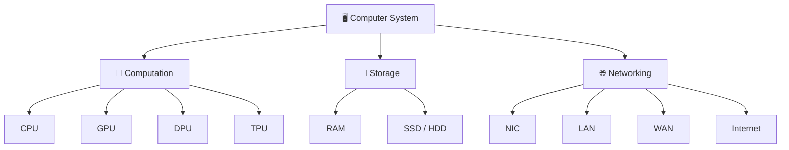

### 🔄 Basic Computer Flow

```text
👤 User
   ↓
📥 Input
   ↓
🧠 Processing
   ↓
💾 Storage
   ↓
📤 Output
   ↓
🌐 Network Communication
```

---

# 🧠 Computation

Computation means processing instructions and data.

Modern computers use different processors for different workloads.

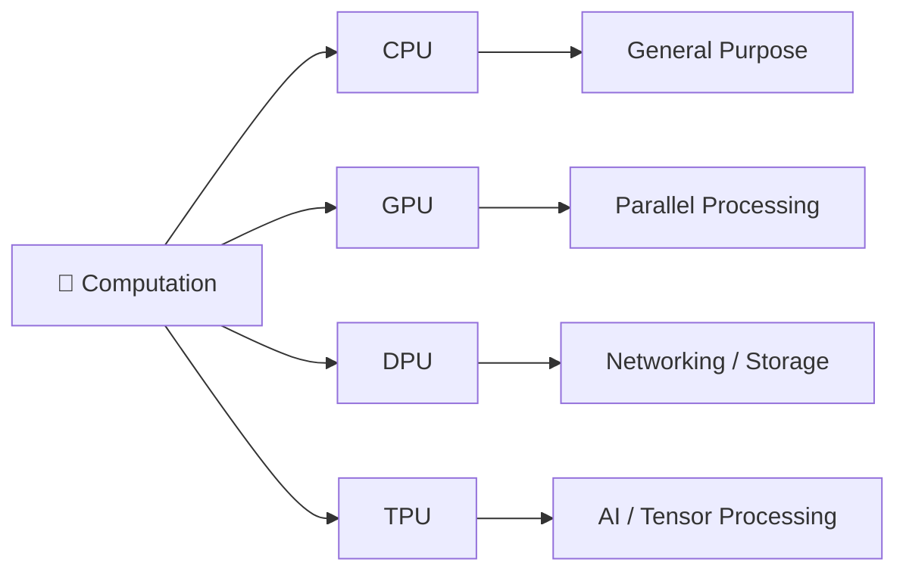

---

## 🧠 CPU

### CPU = Central Processing Unit

The CPU is the main general-purpose processor of a computer.

It performs tasks such as:

* Arithmetic operations
* Logical operations
* Executing instructions
* Process management
* Controlling system operations

It is commonly called the **"brain" of the computer**.

### 🔄 CPU Instruction Cycle

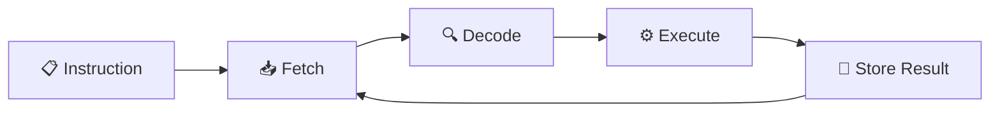

### CPU Components

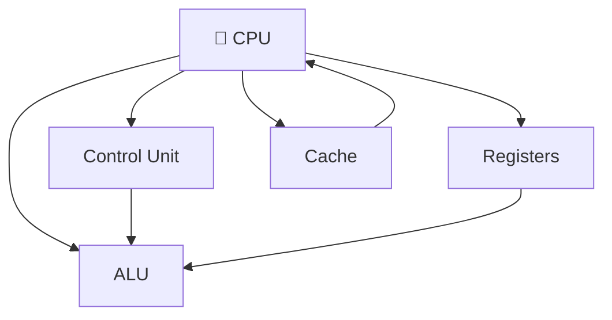

---

## 🎮 GPU

### GPU = Graphics Processing Unit

A GPU is designed to perform highly parallel computations.

It is commonly used for:

* 🎮 Gaming
* 🎨 Graphics rendering
* 🎬 Video processing
* 🤖 Machine learning
* 🔢 Parallel mathematical operations

### CPU vs GPU

| 🧠 CPU                          | 🎮 GPU                        |
| ------------------------------- | ----------------------------- |
| General-purpose                 | Specialized                   |
| Fewer powerful cores            | Many processing units         |
| Excellent sequential processing | Excellent parallel processing |
| OS and application logic        | Graphics and AI workloads     |

### Example

Suppose we need to perform one million calculations.

```text
CPU:

Task 1 → Task 2 → Task 3 → Task 4 → ...


GPU:

┌────────┬────────┬────────┬────────┐
│ Core 1 │ Core 2 │ Core 3 │ Core N │
├────────┼────────┼────────┼────────┤
│ Task 1 │ Task 2 │ Task 3 │ Task N │
└────────┴────────┴────────┴────────┘

             ⚡ Parallel Processing
```

---

## 📦 DPU

### DPU = Data Processing Unit

A DPU is a specialized processor designed to handle infrastructure-related workloads.

It can handle:

* 🌐 Networking
* 💾 Storage processing
* 🔐 Security
* 📦 Data movement
* 🏗️ Infrastructure tasks

### Why DPU?

Without DPU:

```text
CPU
├── Application
├── Networking
├── Storage
└── Security
```

With DPU:

```text
CPU
└── Application

DPU
├── Networking
├── Storage
└── Security
```

The DPU allows the CPU to focus more on application workloads.

---

## 🤖 TPU

### TPU = Tensor Processing Unit

A TPU is a specialized processor designed primarily for machine-learning workloads involving tensor operations.

Common uses:

* 🤖 Neural networks
* 🧮 Matrix operations
* 🧠 Machine learning
* ⚡ AI inference/training

### Processor Comparison

| Processor | Main Purpose                          |
| --------- | ------------------------------------- |
| 🧠 CPU    | General-purpose computation           |
| 🎮 GPU    | Parallel computation / graphics       |
| 📦 DPU    | Infrastructure / networking / storage |
| 🤖 TPU    | AI / tensor computation               |

---

# 🧩 SoC

### SoC = System on a Chip

An SoC integrates multiple components into a single chip.

A typical SoC may contain:

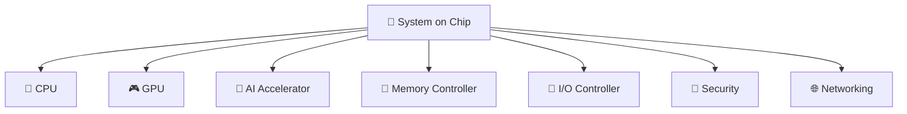

### Advantages

* 📦 Smaller size
* 🔋 Lower power consumption
* ⚡ Faster communication between integrated components
* 💰 Potentially lower cost
* 📱 Excellent for mobile/embedded systems

---

# 💾 Storage

Storage is broadly divided into:

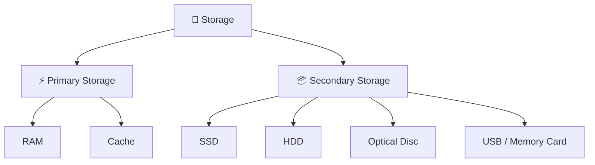

---

## ⚡ Primary Storage

Primary memory is directly accessible by the CPU and is generally much faster than secondary storage.

### RAM

**RAM = Random Access Memory**

RAM is:

* ⚡ Fast
* 🔄 Volatile
* 📦 Used for active programs/data
* 🧠 Directly used during program execution

When power is removed, RAM normally loses its contents.

```text
Application
     ↓
    RAM
     ↓
    CPU
```

---

## 💾 Secondary Storage

Secondary storage is:

* 🟢 Non-volatile
* 📦 Larger capacity
* 🐢 Slower than primary memory
* 💽 Used for long-term storage

Examples:

* SSD
* HDD
* USB drive
* Memory card
* Optical disc

### Primary vs Secondary

| Feature  | ⚡ Primary         | 💾 Secondary      |
| -------- | ----------------- | ----------------- |
| Example  | RAM               | SSD/HDD           |
| Volatile | Usually yes       | No                |
| Speed    | Very fast         | Slower            |
| Capacity | Smaller           | Larger            |
| Purpose  | Active processing | Long-term storage |

---

# 🌐 Networking

Networking allows computers and devices to communicate.

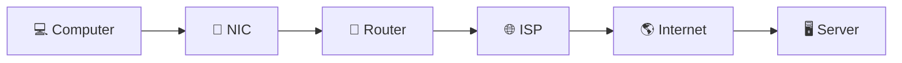

---

# 🏠 LAN

### LAN = Local Area Network

A LAN connects devices within a relatively small geographical area.

Examples:

* 🏠 Home
* 🏢 Office
* 🏫 School
* 🏭 Organization

```text
             📡 Router
            /    |    \
           /     |     \
        💻 PC  📱 Phone  💻 Laptop

                 LAN
```

---

# 🌎 WAN

### WAN = Wide Area Network

A WAN connects networks across large geographical areas.

Examples:

* Multiple cities
* Countries
* Global organizations
* Internet

```text
LAN A
  ↓
📡 Router
  ↓
🌎 WAN / Internet
  ↓
📡 Router
  ↓
LAN B
```

### LAN vs WAN

| LAN                     | WAN                       |
| ----------------------- | ------------------------- |
| 🏠 Small area           | 🌎 Large area             |
| ⚡ Usually lower latency | 🐢 Usually higher latency |
| 🏢 Office/home          | 🌍 Cities/countries       |
| Easier to manage        | More complex              |

---

# 📡 NIC

### NIC = Network Interface Card / Controller

A NIC allows a computer to communicate over a network.

```text
💻 Computer
     ↓
📡 NIC
     ↓
🌐 Network
```

A NIC may provide:

* Ethernet
* Wi-Fi
* MAC addressing
* Data transmission/reception

---

# 📍 IP Address

### IP = Internet Protocol

An IP address provides logical addressing information for communication across networks.

### IPv4

Example:

```text
192.168.1.10
```

IPv4 uses **32-bit addresses**.

### IPv6

Example:

```text
2001:db8::1
```

IPv6 uses **128-bit addresses**.

### Simplified Communication

```text
💻 Client
192.168.1.10
     │
     │ Request
     ↓
🖥️ Server
192.168.1.20
     │
     │ Response
     ↓
💻 Client
```

---

# 🔢 Port Number

A port identifies a service/application endpoint associated with a network connection.

Think of it as:

```text
📍 IP Address = Building Address

🚪 Port = Specific Room / Service
```

### Common Ports

| Protocol  |  Port | Purpose                |
| --------- | ----: | ---------------------- |
| 🔐 SSH    |    22 | Secure remote access   |
| 📞 Telnet |    23 | Remote terminal        |
| 📧 SMTP   |    25 | Email transmission     |
| 🌐 DNS    |    53 | Domain name resolution |
| 🌍 HTTP   |    80 | Web traffic            |
| 🔒 HTTPS  |   443 | Secure web traffic     |
| 📁 FTP    | 20/21 | File transfer          |

---

# 🌐 DNS

### DNS = Domain Name System

DNS translates human-readable domain names into IP addresses.

```text
www.example.com
       ↓
      DNS
       ↓
192.0.2.10
```

### DNS Flow

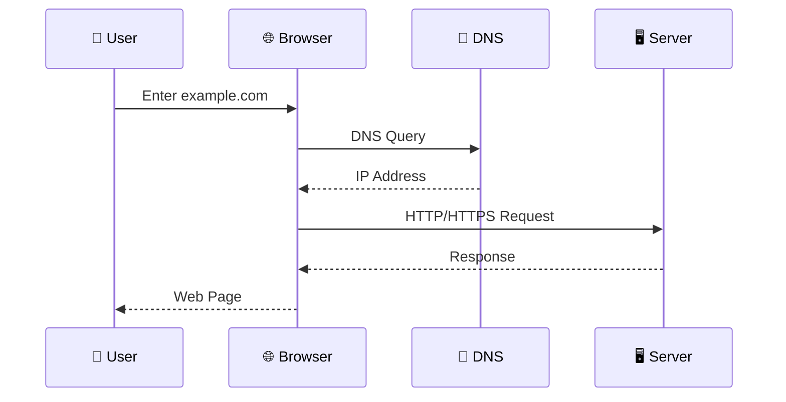

---

# 🌐 ISP

### ISP = Internet Service Provider

An ISP provides internet connectivity.

Common technologies:

### ☎️ DSL

Uses telephone infrastructure.

### 📺 Cable

Uses cable television infrastructure.

### 💡 Fiber Optic

Uses optical fiber and provides high bandwidth.

### 🛰️ Satellite

Uses satellites for communication.

### 📡 Wireless

Uses radio communication.

```text
💻 Device
   ↓
📡 Router / Modem
   ↓
🌐 ISP
   ↓
🌎 Internet
   ↓
🖥️ Server
```

---

# 🔐 VPN

### VPN = Virtual Private Network

A VPN creates an encrypted tunnel between a device and a VPN endpoint.

```text
💻 Device
    │
    │ 🔐 Encrypted Tunnel
    ↓
🛡️ VPN Server
    │
    ↓
🌎 Internet
    │
    ↓
🖥️ Destination
```

VPNs can provide:

* 🔐 Encryption between device and VPN server
* 🏢 Secure remote access
* 🌍 IP address masking from destination services in some configurations

> ⚠️ A VPN does not automatically provide complete anonymity.

---

# 🔀 Proxy Server

A proxy acts as an intermediary between a client and another server.

```text
💻 Client
    ↓
🔀 Proxy
    ↓
🌎 Internet
    ↓
🖥️ Web Server
```

Common uses:

* 🔒 Access control
* 🗂️ Caching
* 🚫 Filtering
* 📊 Monitoring
* 🔀 Intermediary communication

---

# 📦 Packets

Data transmitted over a network is divided into smaller units.

```text
Large Data
    ↓
┌─────┬─────┬─────┬─────┐
│ P1  │ P2  │ P3  │ P4  │
└─────┴─────┴─────┴─────┘
    ↓
🌐 Network
    ↓
🖥️ Destination
    ↓
Reassembled Data
```

### Simplified Protocol Data Units

```text
Application Data
       ↓
Transport → Segment / Datagram
       ↓
Network → Packet
       ↓
Data Link → Frame
       ↓
Physical → Bits
```

---

# ⚖️ Load Balancer

A load balancer distributes incoming traffic among multiple servers.

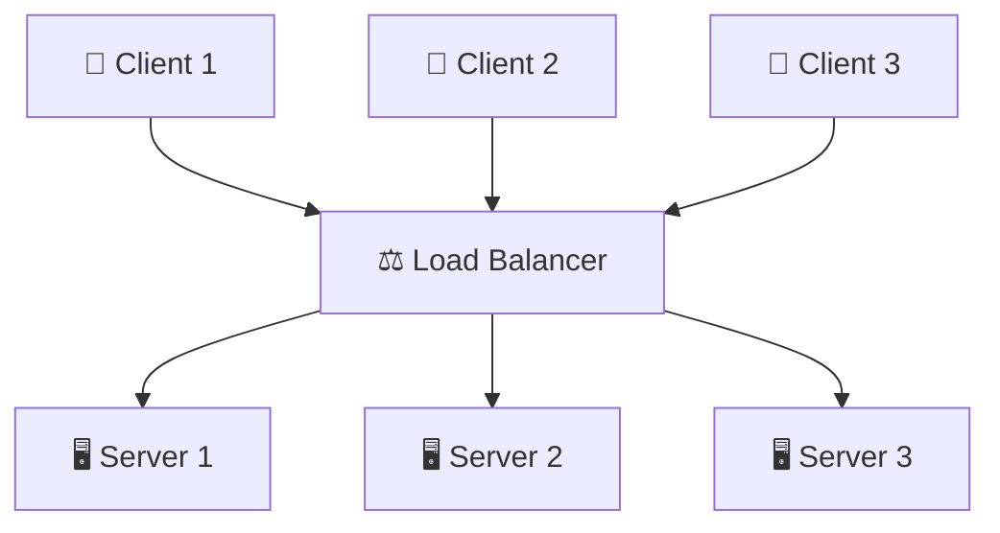

### Benefits

* ⚖️ Traffic distribution
* 📈 Scalability
* 🔄 High availability
* ❤️ Health checks
* 🛡️ Prevent server overload

---

# 💻 Operating System

An operating system manages computer hardware and provides services to applications.

Examples:

* 🪟 Windows
* 🍎 macOS
* 🐧 Linux
* 🤖 Android
* 📱 iOS

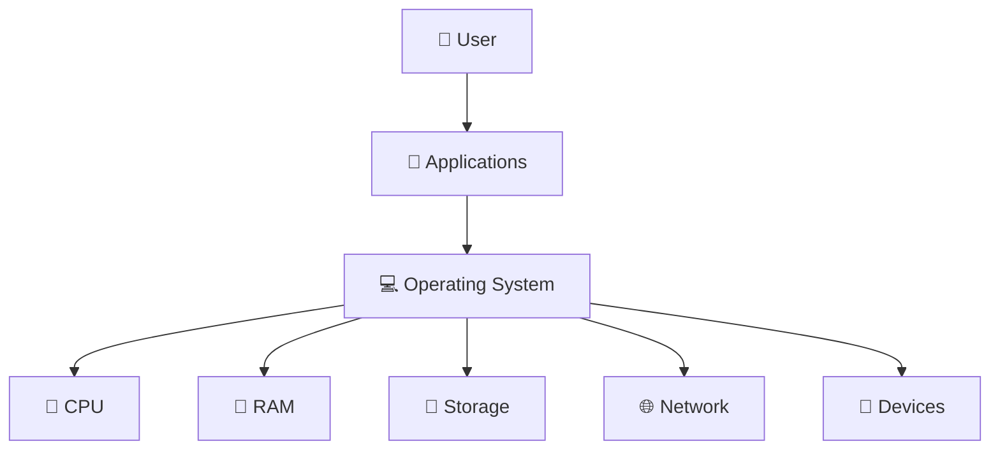

### Major Responsibilities

* ⚙️ Process management
* 🧠 Memory management
* 📁 File management
* 🔌 Device management
* 🌐 Networking
* 🔐 Security
* 👤 User management

---

# 🔑 Kernel

The kernel is the core component of an operating system.

It manages communication between software and hardware.

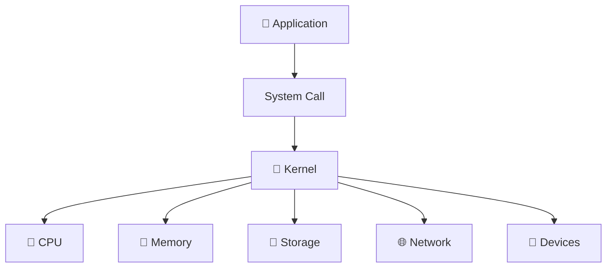

### Example: Reading a File

```text
📱 Application
      ↓
System Call
      ↓
🔑 Kernel
      ↓
📁 File System
      ↓
💽 Storage
      ↓
📄 File Data
```

---

# 🔓 Open Source vs Closed Source

## 🟢 Open Source

Source code is made available under an open-source license that permits specified uses, modifications and redistribution.

Examples:

* 🐧 Linux
* 🐍 Python
* ☸️ Kubernetes
* 🐘 PostgreSQL

## 🔴 Closed / Proprietary Source

Source code is generally not publicly available for modification and redistribution.

### Comparison

| 🟢 Open Source                    | 🔴 Proprietary                       |
| --------------------------------- | ------------------------------------ |
| Source available under license    | Source generally unavailable         |
| Can be inspected                  | Usually cannot be inspected publicly |
| Modification may be allowed       | Controlled by owner                  |
| Redistribution depends on license | Usually restricted                   |

> 💡 Open source does **not** mean "without a license."

---

# ☁️ Cloud Computing

Cloud computing provides computing resources over a network, usually the Internet.

Services include:

* 🖥️ Compute
* 💾 Storage
* 🗄️ Databases
* 🌐 Networking
* 🔐 Security
* 🤖 AI/ML
* 📊 Analytics

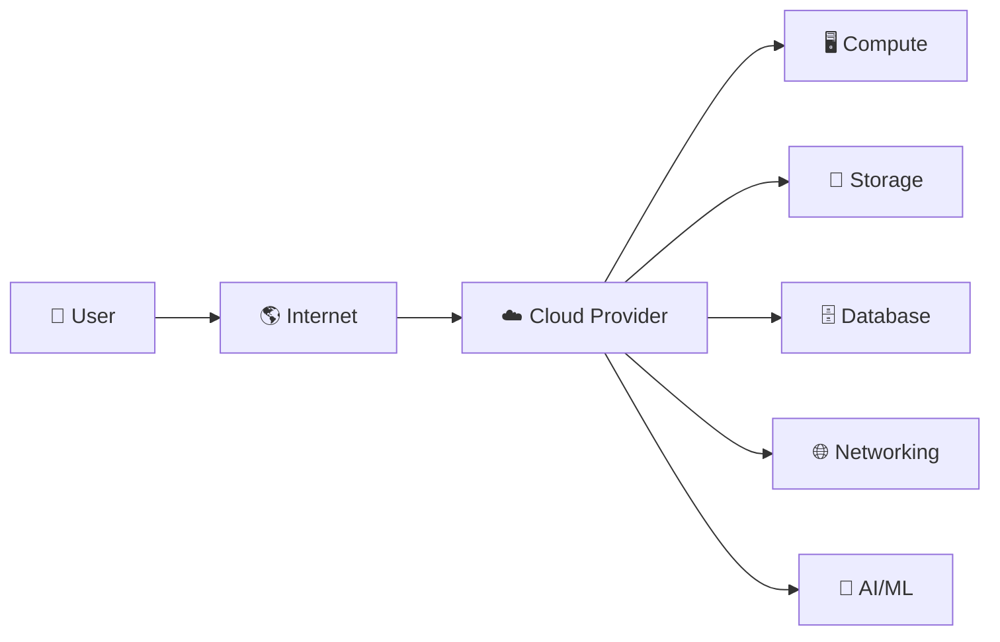

### Service Models

| Model    | Meaning                     |
| -------- | --------------------------- |
| 🏗️ IaaS | Infrastructure as a Service |
| 🛠️ PaaS | Platform as a Service       |
| 📱 SaaS  | Software as a Service       |

---

# 🖥️ Bare Metal

A bare-metal system runs workloads directly on physical hardware rather than inside a virtual machine.

```text
Bare Metal:

Application
    ↓
Physical Hardware
```

Compared with a VM:

```text
Application
    ↓
Guest OS
    ↓
Virtual Hardware
    ↓
Hypervisor
    ↓
Physical Hardware
```

### Common Uses

* 🚀 High-performance computing
* 🖥️ Dedicated servers
* 🔌 Embedded systems
* 🏭 Specialized infrastructure

---

# 🧱 Blockchain

Blockchain is a distributed ledger technology where records are grouped into blocks and linked using cryptographic mechanisms.

```text
┌──────────┐
│ Block 1  │
└────┬─────┘
     ↓
┌──────────┐
│ Block 2  │
└────┬─────┘
     ↓
┌──────────┐
│ Block 3  │
└────┬─────┘
     ↓
┌──────────┐
│ Block 4  │
└──────────┘
```

### Block can contain

* 📋 Transactions/data
* ⏰ Timestamp
* 🔐 Cryptographic information
* 🔗 Reference to previous block

### Applications

* ₿ Cryptocurrency
* 📜 Smart contracts
* 🚚 Supply chain
* 🪙 Digital assets
* 🌐 Decentralized applications

---

# 🏗️ CPU Architectures & ISAs

## ISA

### ISA = Instruction Set Architecture

An ISA defines the instructions and programmer-visible behavior supported by a processor architecture.

Examples:

* x86 / x86-64
* ARM
* RISC-V

```text
Software
   ↓
ISA
   ↓
Microarchitecture
   ↓
Physical CPU
```

---

# 🏗️ CISC

### CISC = Complex Instruction Set Computer

CISC is a processor design philosophy involving a relatively rich/complex instruction set.

The most famous example is **x86**.

```text
Software
   ↓
x86 / x86-64
   ↓
CPU Microarchitecture
   ↓
Hardware
```

Intel and AMD produce many processors implementing x86/x86-64.

---

# ⚡ RISC

### RISC = Reduced Instruction Set Computer

RISC is a processor design philosophy emphasizing a relatively simple instruction set and efficient implementation.

ARM processors are based on RISC principles.

---

# 🟢 RISC-V

RISC-V is an **open-standard ISA** based on RISC principles.

It can be implemented by different organizations.

Common areas:

* 🔌 Embedded systems
* 🎓 Education
* 🔬 Research
* 🧠 Processors
* 🤖 Accelerators

### SHAKTI

SHAKTI is an open-source processor project based on RISC-V developed by researchers at IIT Madras.

### Architecture Comparison

| ISA        | Style | Model                    |
| ---------- | ----- | ------------------------ |
| x86/x86-64 | CISC  | Proprietary ISA          |
| ARM        | RISC  | Proprietary/licensed ISA |
| RISC-V     | RISC  | Open-standard ISA        |

> ⚠️ RISC-V was not created in 2023; the architecture originated earlier and has continued evolving.

---

# 🔧 ASIC

### ASIC = Application-Specific Integrated Circuit

An ASIC is a chip designed for a particular application or workload.

Examples:

* ₿ Cryptocurrency mining
* 🌐 Network processing
* 🎥 Video processing
* 🤖 AI acceleration

```text
General CPU
    ↓
Many possible workloads

ASIC
    ↓
Specific workload
```

### Advantages

* ⚡ High performance
* 🔋 High efficiency
* 🎯 Specialized

### Disadvantages

* 💰 Expensive design
* ⏳ Long development cycle
* 🔒 Not easily reprogrammable

---

# 🧩 FPGA

### FPGA = Field-Programmable Gate Array

An FPGA contains programmable logic that can be configured after manufacturing.

```text
FPGA
├── 🧩 Programmable Logic
├── 🔗 Interconnects
├── 💾 Memory
└── 🔌 I/O
```

### FPGA vs ASIC

| FPGA                         | ASIC                                  |
| ---------------------------- | ------------------------------------- |
| 🔄 Reprogrammable            | 🔒 Fixed                              |
| 🧩 Flexible                  | 🎯 Specialized                        |
| ⚡ Faster development         | ⏳ Longer development                  |
| 🧪 Excellent for prototyping | 🏭 Excellent for high-volume products |

---

# 🔬 Semiconductors

Semiconductors are fundamental materials and technologies used to build modern electronic devices.

Examples:

* 🧠 CPUs
* 🎮 GPUs
* 💾 Memory
* 📡 Network chips
* 🤖 AI accelerators
* 🔌 Microcontrollers

### Semiconductor Manufacturing

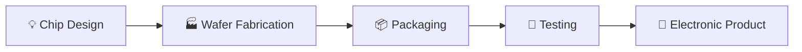

### Major Companies

Examples:

* TSMC
* Intel
* Samsung

### Manufacturing Equipment

ASML is a major supplier of advanced lithography equipment used in semiconductor manufacturing.

---

# 🖼️ Semiconductor Reference


---

# 🏛️ Von Neumann vs Harvard Architecture

## Von Neumann

Instructions and data share the same memory system.

```text
             🧠 CPU
               │
               ↓
      ┌─────────────────┐
      │  Shared Memory  │
      │                 │
      │ Instructions    │
      │ Data            │
      └─────────────────┘
```

## Harvard

Instructions and data use separate memory paths.

```text
             🧠 CPU
            /     \
           ↓       ↓
   📋 Instruction  💾 Data
      Memory       Memory
```

### Comparison

| Von Neumann            | Harvard                          |
| ---------------------- | -------------------------------- |
| Shared memory          | Separate instruction/data memory |
| Simpler design         | More specialized                 |
| Shared pathways        | Separate pathways possible       |
| Common general concept | Common in embedded/DSP designs   |

Modern processors can use **modified Harvard** designs internally.

---

# 🌍 Frontend, Backend & API

A web application commonly contains:

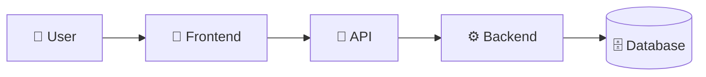

---

## 🎨 Frontend

Frontend is the client-side part of an application.

Users interact with:

* HTML
* CSS
* JavaScript
* React
* Angular
* Vue

```text
🌐 Browser
   ↓
HTML + CSS + JavaScript
   ↓
🎨 User Interface
```

---

## ⚙️ Backend

Backend runs on servers.

Responsibilities include:

* Authentication
* Authorization
* Business logic
* Database operations
* API implementation
* Data validation

Technologies include:

* Python
* Java
* Node.js
* Go
* C#
* PHP

---

## 🔌 API

### API = Application Programming Interface

An API defines how software components communicate.

```text
🎨 Frontend
     ↓
GET /users
     ↓
🔌 API
     ↓
⚙️ Backend
     ↓
🗄️ Database
     ↓
JSON Response
     ↓
🎨 Frontend
```

---

# 📡 OSI Model

The OSI model contains **7 layers**.

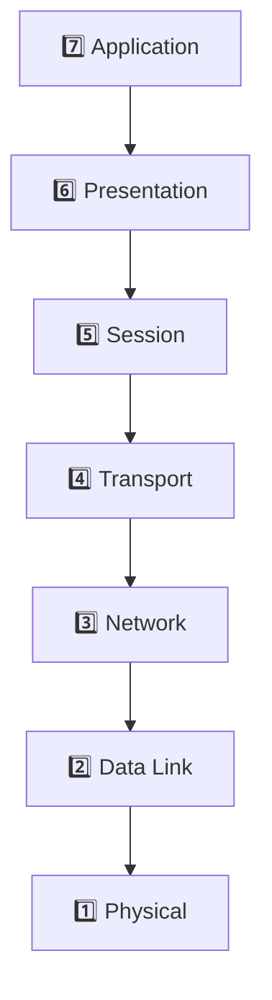

---

## 7️⃣ Layer 7 — Application

Used by applications for network services.

Examples:

* HTTP
* DNS
* SMTP
* FTP

---

## 6️⃣ Layer 6 — Presentation

Responsible for data representation.

Examples of responsibilities:

* Encoding
* Formatting
* Compression
* Encryption/decryption concepts

---

## 5️⃣ Layer 5 — Session

Manages communication sessions.

Responsibilities:

* Session establishment
* Session management
* Session termination

---

## 4️⃣ Layer 4 — Transport

Provides end-to-end transport.

Important protocols:

* TCP
* UDP

Common data units:

* TCP → Segment
* UDP → Datagram

---

## 3️⃣ Layer 3 — Network

Responsible for:

* Logical addressing
* Routing
* Packet forwarding

Example:

```text
🌐 IP
```

Data unit:

```text
📦 Packet
```

---

## 2️⃣ Layer 2 — Data Link

Responsible for communication over a local link.

Examples:

* Ethernet
* Wi-Fi link-layer mechanisms

Data unit:

```text
🖼️ Frame
```

---

## 1️⃣ Layer 1 — Physical

Responsible for transmitting raw bits through physical/radio media.

Examples:

* Copper
* Fiber
* Radio

---

### 🧠 OSI Mnemonic

> **All People Seem To Need Data Processing**

```text
A → Application
P → Presentation
S → Session
T → Transport
N → Network
D → Data Link
P → Physical
```

---

# 🔐 SSL/TLS

### SSL = Secure Sockets Layer

SSL is an older security protocol family.

Modern secure communication uses:

### TLS = Transport Layer Security

HTTPS can be thought of as:

```text
HTTPS
  ↓
HTTP + TLS
```

### HTTPS Flow

```text
🌐 Browser
    ↓
🔐 TLS
    ↓
🌐 TCP
    ↓
📍 IP
    ↓
🖥️ Server
```

TLS provides security properties including:

* 🔒 Encryption
* 🪪 Authentication
* 🛡️ Integrity

> ⚠️ `IP Address + Port` is **not SSL**. IP + Port identifies a network endpoint.

---

# 🌐 Apache Web Server

Apache HTTP Server is a popular open-source web server.

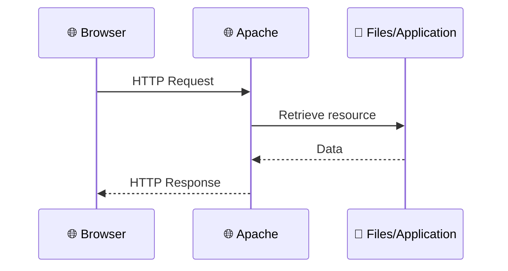

### `httpd`

`httpd` commonly refers to the Apache HTTP Server daemon.

A daemon is a background process that provides a service.

```text
🌐 Browser
    ↓
HTTP Request
    ↓
🌐 Apache httpd
    ↓
📄 HTML/CSS/JS
    ↓
🌐 Browser
```

---

# 🔄 DevOps

### DevOps = Development + Operations

DevOps combines practices, culture, processes and tools to improve software delivery and operations.

### Traditional

```text
👨‍💻 Development
      ↓
    Code
      ↓
"Throw over the wall"
      ↓
⚙️ Operations
      ↓
   Deploy
```

### DevOps

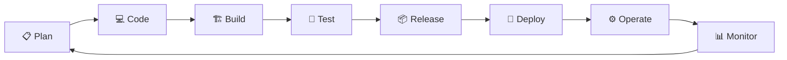

### Common DevOps Tools

| Area               | Examples                   |
| ------------------ | -------------------------- |
| 📦 Version Control | Git                        |
| 🐙 Repository      | GitHub                     |
| 🦊 DevOps Platform | GitLab                     |
| 🔄 CI/CD           | GitHub Actions / GitLab CI |
| 🐳 Containers      | Docker                     |
| ☸️ Orchestration   | Kubernetes                 |
| 🏗️ Infrastructure | Terraform                  |
| ☁️ Cloud           | AWS / Azure / GCP          |
| 📊 Monitoring      | Prometheus / Grafana       |

---

# ☁️ AWS EC2

### EC2 = Elastic Compute Cloud

EC2 provides virtual servers in AWS.

## 🚀 EC2 Deployment Flow

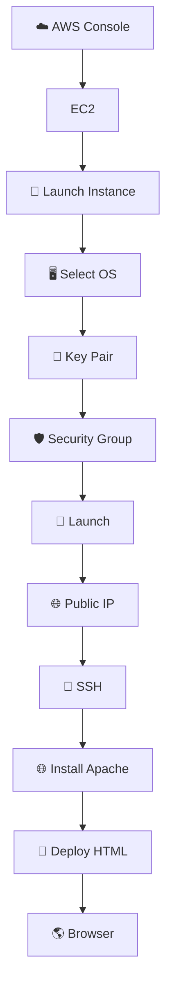

---

## 1️⃣ Launch EC2

1. Open AWS.
2. Search for **EC2**.
3. Select **Launch Instance**.
4. Choose an OS/AMI.
5. Select instance type.
6. Create/select key pair.
7. Configure networking/security.
8. Launch.

---

## 2️⃣ Connect Using SSH

```text
💻 Your Computer
       ↓
🔐 SSH
       ↓
☁️ AWS EC2
```

For Linux instances, SSH is commonly used for remote access.

---

## 3️⃣ Update Ubuntu

```bash
sudo apt update
```

---

## 4️⃣ Install Apache

```bash
sudo apt install apache2
```

Check Apache:

```bash
sudo systemctl status apache2
```

---

## 5️⃣ Root Access

```bash
sudo su
```

Prompt may change:

```text
$
```

to:

```text
#
```

⚠️ Be careful when working as root.

---

## 6️⃣ Apache Web Directory

```bash
cd /var/www/html/
```

List files:

```bash
ls
```

---

## 7️⃣ Remove Default Page

```bash
rm index.html
```

---

## 8️⃣ Create New Page

```bash
vi index.html
```

Press:

```text
i
```

Then enter:

```html
<!DOCTYPE html>
<html>
<head>
    <title>My AWS Server</title>
</head>
<body>
    <h1>Hello from AWS EC2 🚀</h1>
</body>
</html>
```

Save:

```text
Esc
:wq
Enter
```

---

## 🌎 Complete EC2 Web Flow

```text
🌐 Browser
     │
     │ HTTP Request
     ↓
🌎 Public IP
     ↓
☁️ AWS Network
     ↓
🖥️ EC2
     ↓
🌐 Apache
     ↓
📁 /var/www/html/
     ↓
📄 index.html
     ↓
🌐 Browser
```

---

# 🐳 Docker

Docker is a platform for building, packaging and running applications using containers.

### VM

```text
Physical Hardware
       ↓
Hypervisor
       ↓
VM
       ↓
Guest OS
       ↓
Application
```

### Container

```text
Physical Hardware
       ↓
Host OS
       ↓
Docker Engine
       ↓
Container
       ↓
Application
```

### Important Difference

A VM normally includes a guest operating system.

A container shares the host kernel.

---

# 🐳 Docker Image vs Container

This is one of the most important Docker concepts.

```text
🐳 Docker Image
       ↓
Template / Blueprint
       ↓
📦 Container
       ↓
Running Application
```

One image can create multiple containers:

```text
        🐳 nginx Image
          /       \
         /         \
        ↓           ↓
 📦 Container 1  📦 Container 2
```

---

# 🐳 Docker Commands

| Command             | Purpose                |
| ------------------- | ---------------------- |
| `docker --version`  | Show version           |
| `docker ps`         | Running containers     |
| `docker ps -a`      | All containers         |
| `docker pull IMAGE` | Download image         |
| `docker run IMAGE`  | Create/start container |
| `docker stop NAME`  | Stop container         |
| `docker start NAME` | Start container        |
| `docker rm NAME`    | Remove container       |
| `docker images`     | List images            |

---

# 🌐 Nginx with Docker

Nginx is a web server and reverse proxy.

### Pull Nginx

```bash
docker pull nginx
```

---

## 🚀 Run Nginx

```bash
docker run --name docker-nginx -p 80:80 nginx
```

### Explanation

```text
docker run
```

Create and start a container.

```text
--name docker-nginx
```

Container name.

```text
-p 80:80
```

Port mapping:

```text
Host Port 80
     ↓
Container Port 80
```

```text
nginx
```

Docker image.

---

# 🌐 Nginx Architecture

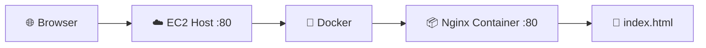

---

# 🐳 Run Nginx in Background

```bash
docker run --name docker-nginx -p 80:80 -d nginx
```

The `-d` flag runs the container in detached/background mode.

Check:

```bash
docker ps
```

---

# ⛔ Stop Nginx

```bash
docker stop docker-nginx
```

---

# 🗑️ Remove Nginx Container

```bash
docker rm docker-nginx
```

---

# 📋 View All Containers

```bash
docker ps -a
```

---

# 🌐 Build Your Own Website with Nginx

Create directory:

```bash
mkdir -p ~/docker-nginx/html
```

Navigate:

```bash
cd ~/docker-nginx/html
```

Create HTML:

```bash
vi index.html
```

Example:

```html
<!DOCTYPE html>
<html>
<head>
    <title>Docker Nginx</title>
</head>
<body>
    <h1>Hello from Nginx + Docker 🐳</h1>
</body>
</html>
```

---

# 🔗 Bind Mount

Run:

```bash
docker run \
  --name docker-nginx \
  -p 80:80 \
  -d \
  -v ~/docker-nginx/html:/usr/share/nginx/html \
  nginx
```

### What does `-v` do?

It creates a bind mount:

```text
HOST
~/docker-nginx/html
        │
        │ 🔗 Bind Mount
        ↓
CONTAINER
/usr/share/nginx/html
```

Therefore:

```text
📄 Host HTML
    ↓
🔗 Bind Mount
    ↓
🐳 Nginx Container
    ↓
🌐 Web Server
    ↓
👤 User
```

---

# ⚙️ Custom Nginx Configuration

Navigate:

```bash
cd ~/docker-nginx
```

Copy Nginx configuration:

```bash
docker cp docker-nginx:/etc/nginx/conf.d/default.conf default.conf
```

Project structure:

```text
docker-nginx/
│
├── html/
│   └── index.html
│
└── default.conf
```

---

## 🔄 Recreate Container

Stop:

```bash
docker stop docker-nginx
```

Remove:

```bash
docker rm docker-nginx
```

Run:

```bash
docker run \
  --name docker-nginx \
  -p 80:80 \
  -v ~/docker-nginx/html:/usr/share/nginx/html \
  -v ~/docker-nginx/default.conf:/etc/nginx/conf.d/default.conf \
  -d \
  nginx
```

---

## 🧪 Test Nginx Configuration

```bash
docker exec docker-nginx nginx -t
```

Restart:

```bash
docker restart docker-nginx
```

---

# 🐳 Docker + Nginx Complete Architecture

```mermaid
flowchart TD
    User[👤 User]
    User --> Browser[🌐 Browser]

    Browser --> PublicIP[🌎 EC2 Public IP :80]

    PublicIP --> Docker[🐳 Docker Engine]

    Docker --> Nginx[🌐 Nginx Container]

    Nginx --> Config[/etc/nginx/conf.d/default.conf]
    Nginx --> HTML[/usr/share/nginx/html]

    Config -. Bind Mount .-> HostConfig[~/docker-nginx/default.conf]
    HTML -. Bind Mount .-> HostHTML[~/docker-nginx/html]
```

---

# 🧱 Data Structures

A data structure organizes data so that it can be accessed and modified efficiently.

```text
🧱 Data Structures
│
├── 📦 Array
├── 🔗 Linked List
├── 📚 Stack
├── 🚶 Queue
├── 🔑 Hash Table
├── 🌳 Tree
├── ⛰️ Heap
└── 🕸️ Graph
```

### Common Uses

| Data Structure | Common Use             |
| -------------- | ---------------------- |
| Array          | Indexed data           |
| Linked List    | Sequential nodes       |
| Stack          | LIFO                   |
| Queue          | FIFO                   |
| Hash Table     | Key/value lookup       |
| Tree           | Hierarchical data      |
| Graph          | Relationships/networks |

---

# 🧩 Object-Oriented Programming

### OOP = Object-Oriented Programming

Important concepts:

```mermaid
mindmap
  root((🧩 OOP))
    Class
    Object
    Encapsulation
    Abstraction
    Inheritance
    Polymorphism
```

---

## 📐 Class

A class is a blueprint.

```python
class Car:
    def __init__(self, brand):
        self.brand = brand
```

---

## 🚗 Object

An object is an instance of a class.

```python
car1 = Car("Toyota")
car2 = Car("Honda")
```

```text
Class
 ↓
Blueprint

Object
 ↓
Actual Instance
```

---

# 🔒 Encapsulation

Encapsulation combines data and methods and can restrict direct access to internal implementation details.

```python
class BankAccount:
    def __init__(self):
        self.__balance = 0

    def deposit(self, amount):
        self.__balance += amount

    def get_balance(self):
        return self.__balance
```

---

# 🎯 Abstraction

Abstraction means exposing the important interface while hiding unnecessary implementation details.

Example:

```text
🚗 Car
   ↓
start()
```

The user doesn't need to understand every internal engine operation.

---

# 🧬 Inheritance

Inheritance allows one class to derive functionality from another.

```text
             Vehicle
                │
       ┌────────┼────────┐
       ↓        ↓        ↓
      Car      Bike     Truck
```

Example:

```python
class Vehicle:
    def move(self):
        print("Moving")


class Car(Vehicle):
    pass
```

---

# 🔄 Polymorphism

Polymorphism allows the same interface/method to behave differently depending on the object.

```python
class Dog:
    def sound(self):
        return "Bark"


class Cat:
    def sound(self):
        return "Meow"


animals = [Dog(), Cat()]

for animal in animals:
    print(animal.sound())
```

Output:

```text
Bark
Meow
```

---

# 🔐 Cryptography

Cryptography protects information using mathematical techniques.

It helps provide:

* 🔒 Confidentiality
* 🛡️ Integrity
* 🪪 Authentication
* ✍️ Digital signatures / non-repudiation in appropriate systems

### Basic Flow

```text
📄 Plaintext
     ↓
🔐 Encryption
     ↓
🔒 Ciphertext
     ↓
🌐 Transmission
     ↓
🔓 Decryption
     ↓
📄 Plaintext
```

---

# 🔑 Symmetric Cryptography

Uses the **same secret key** for encryption and decryption.

```text
             🔑 Same Key
            /           \
           ↓             ↓
📄 Plaintext → 🔐 Encrypt → 🔒 Ciphertext
                              ↓
                          🔓 Decrypt
                              ↓
                         📄 Plaintext
```

Examples:

* AES
* ChaCha20

### Advantage

⚡ Fast and suitable for large amounts of data.

### Challenge

The communicating parties need a secure method to establish/share the secret key.

---

# 🔐 Asymmetric Cryptography

Uses a pair of keys:

* 🔓 Public key
* 🔐 Private key

```text
🔓 Public Key
      ↓
🔐 Encryption
      ↓
🔒 Ciphertext
      ↓
🔐 Private Key
      ↓
📄 Plaintext
```

Examples:

* RSA
* Elliptic-curve cryptography

---

# 🐍 Python

Python is a high-level, general-purpose programming language known for readable syntax and a large ecosystem.

Python supports:

* Procedural programming
* Object-oriented programming
* Functional programming

Example:

```python
name = "Alice"

print(f"Hello, {name}!")
```

### Why Python?

* 🧠 Easy to learn
* 🤖 AI/ML
* 🌐 Web development
* ⚙️ Automation
* 📊 Data science
* 🔧 DevOps
* 🧪 Testing

### Python Ecosystem

```text
🐍 Python
│
├── 🌐 Web
│   ├── Django
│   ├── Flask
│   └── FastAPI
│
├── 📊 Data
│   ├── NumPy
│   └── Pandas
│
├── 🤖 AI/ML
│   ├── PyTorch
│   └── TensorFlow
│
└── ⚙️ Automation
    └── Scripts / CLI
```

---

# 🗄️ Database Management System

### DBMS = Database Management System

A DBMS is software used to:

* ➕ Create data
* 💾 Store data
* 🔍 Retrieve data
* ✏️ Update data
* 🗑️ Delete data
* 🔐 Control access
* 🛡️ Protect data

Examples:

* MySQL
* PostgreSQL
* Oracle
* MongoDB

---

# 🗃️ Relational Database

Relational databases primarily organize data in tables.

```text
Users

+----+--------+-----+
| ID | Name   | Age |
+----+--------+-----+
| 1  | Alice  | 25  |
| 2  | Bob    | 30  |
+----+--------+-----+
```

Examples:

* MySQL
* PostgreSQL
* Oracle
* SQL Server

---

# 📦 NoSQL Database

NoSQL databases use various non-relational data models.

Example MongoDB-style document:

```json
{
  "name": "Alice",
  "age": 25
}
```

---

# 🔄 CRUD

CRUD means:

```text
C → Create
R → Read
U → Update
D → Delete
```

---

# 📦 Git, GitHub, GitLab & GitOps

## 🌱 Git

Git is a distributed version control system.

```mermaid
flowchart LR
    A[💻 Working Directory]
    B[📦 Staging Area]
    C[🗃️ Local Repository]
    D[☁️ Remote Repository]

    A -->|git add| B
    B -->|git commit| C
    C -->|git push| D
    D -->|git pull| A
```

---

# 🐙 GitHub

GitHub is a platform for hosting Git repositories and collaborating on software.

Common features:

* 📦 Repositories
* 🔀 Pull Requests
* 🐛 Issues
* 👀 Code Review
* ⚙️ GitHub Actions
* 📋 Project Management

---

# 🦊 GitLab

GitLab is a DevOps platform that provides:

* Git repositories
* CI/CD
* Planning
* Security features
* Package/container registries
* Deployment tooling

---

# 🔄 GitOps

GitOps uses Git as a source of truth for desired infrastructure/application state.

```mermaid
flowchart LR
    Dev[👨‍💻 Developer] --> Git[📦 Git Repository]
    Git --> Controller[⚙️ Automation / Controller]
    Controller --> Infra[☁️ Infrastructure]
    Infra --> Monitor[📊 Monitoring]
    Monitor --> Feedback[🔄 Feedback]
    Feedback --> Git
```

---

# 🏗️ Complete Web Application Architecture

Let's combine everything.

```mermaid
flowchart TD
    User[👤 User]
    User --> Browser[🌐 Browser]

    Browser --> DNS[📖 DNS]
    DNS --> LB[⚖️ Load Balancer]

    LB --> Web1[🌐 Web Server 1]
    LB --> Web2[🌐 Web Server 2]

    Web1 --> API1[⚙️ Backend API]
    Web2 --> API2[⚙️ Backend API]

    API1 --> DB[(🗄️ Database)]
    API2 --> DB

    DB --> Storage[(💾 Persistent Storage)]
```

---

# ☁️ Complete Cloud + Docker Architecture

```mermaid
flowchart TD
    User[👤 User]
    User --> Internet[🌎 Internet]

    Internet --> DNS[📖 DNS]
    DNS --> LB[⚖️ Load Balancer]

    LB --> EC1[☁️ EC2 Instance 1]
    LB --> EC2[☁️ EC2 Instance 2]

    EC1 --> Docker1[🐳 Docker]
    EC2 --> Docker2[🐳 Docker]

    Docker1 --> Nginx1[🌐 Nginx]
    Docker2 --> Nginx2[🌐 Nginx]

    Nginx1 --> Backend1[⚙️ Backend]
    Nginx2 --> Backend2[⚙️ Backend]

    Backend1 --> DB[(🗄️ Database)]
    Backend2 --> DB

    DB --> Storage[(💾 Storage)]
```

---

# 🔄 Code to Production

Modern DevOps workflow:

```mermaid
flowchart LR
    Code[💻 Write Code]
    Git[📦 Git]
    CI[⚙️ CI Pipeline]
    Test[🧪 Test]
    Build[🏗️ Build]
    Registry[📦 Container Registry]
    Deploy[🚀 Deploy]
    Cloud[☁️ Cloud]
    Monitor[📊 Monitor]

    Code --> Git
    Git --> CI
    CI --> Test
    Test --> Build
    Build --> Registry
    Registry --> Deploy
    Deploy --> Cloud
    Cloud --> Monitor
    Monitor --> Git
```

---

# 🧠 Complete Mental Model

This is the most important diagram in the entire repository.

```mermaid
flowchart TD
    Hardware[🖥️ Hardware]

    Hardware --> Compute[🧠 CPU / GPU / DPU / TPU]
    Hardware --> Memory[💾 Memory / Storage]
    Hardware --> Network[🌐 Networking]

    Compute --> OS[💻 Operating System]
    Memory --> OS
    Network --> OS

    OS --> Kernel[🔑 Kernel]

    Kernel --> Virtualization[🖥️ Virtualization]
    Virtualization --> Hypervisor[⚙️ Hypervisor]
    Hypervisor --> VM[🖥️ Virtual Machine]

    VM --> Docker[🐳 Docker]
    Docker --> Container[📦 Container]

    Container --> WebServer[🌐 Nginx / Apache]
    WebServer --> Backend[⚙️ Backend]
    Backend --> Database[🗄️ Database]

    Database --> Application[🚀 Application]
    Application --> User[👤 User]
```

---

# 🧠 One-Line Mental Model

> 🖥️ **Hardware** provides computation and storage → 💻 **OS** manages resources → 🌐 **Networking** provides communication → 🖥️ **Virtualization** creates VMs → 🐳 **Docker** creates containers → 🌐 **Web Servers** serve applications → ⚙️ **Backend** handles business logic → 🗄️ **Database** stores data → 🚀 **DevOps** automates deployment and operations.

---

# 📊 Quick Revision Cheat Sheet

## 🖥️ Hardware

```text
🧠 CPU  → General-purpose processing
🎮 GPU  → Parallel / graphics processing
📦 DPU  → Data / infrastructure processing
🤖 TPU  → AI / tensor processing
🧩 SoC  → Multiple components integrated into one chip
🔧 ASIC → Application-specific hardware
🧩 FPGA → Reprogrammable hardware
```

---

## 💾 Storage

```text
⚡ RAM → Volatile + Fast
💽 SSD → Non-volatile + Fast secondary storage
💽 HDD → Non-volatile + Large capacity
```

---

## 🌐 Networking

```text
📡 NIC        → Network interface
📍 IP         → Logical network addressing
🔢 Port       → Service/application endpoint
📖 DNS        → Domain → IP resolution
🔐 VPN        → Encrypted network tunnel
🔀 Proxy      → Intermediary
📡 Router     → Forwards traffic between networks
⚖️ Load Balancer → Distributes traffic
```

---

## 🔢 Common Ports

```text
🔐 SSH       → 22
📞 Telnet    → 23
📧 SMTP      → 25
📖 DNS      → 53
🌐 HTTP      → 80
🔒 HTTPS     → 443
📁 FTP       → 20/21
```

---

## 📡 OSI Model

```text
7️⃣ Application
6️⃣ Presentation
5️⃣ Session
4️⃣ Transport
3️⃣ Network
2️⃣ Data Link
1️⃣ Physical
```

Mnemonic:

> **All People Seem To Need Data Processing**

---

## 🖥️ Virtualization

```text
Physical Hardware
       ↓
⚙️ Hypervisor
       ↓
┌──────┼──────┐
↓      ↓      ↓
VM1    VM2    VM3
```

### Type 1

```text
Hardware
   ↓
Hypervisor
   ↓
VMs
```

### Type 2

```text
Hardware
   ↓
Host OS
   ↓
Hypervisor
   ↓
VMs
```

---

## 🐳 Docker

```text
🐳 Image
   ↓
📦 Container
   ↓
🚀 Application
```

---

## ☁️ AWS EC2

```text
☁️ AWS
 ↓
🖥️ EC2
 ↓
🐧 Ubuntu
 ↓
🌐 Apache
 ↓
📁 /var/www/html
 ↓
📄 index.html
 ↓
🌎 Public IP
 ↓
🌐 Browser
```

---

## 🌐 Docker + Nginx

```text
☁️ AWS EC2
    ↓
🐳 Docker
    ↓
📦 Nginx Container
    ↓
🔢 Port 80
    ↓
📄 HTML
    ↓
🌐 Browser
```

---

## 🧩 OOP

```text
🧩 OOP
├── 📐 Class
├── 🚗 Object
├── 🔒 Encapsulation
├── 🎯 Abstraction
├── 🧬 Inheritance
└── 🔄 Polymorphism
```

---

## 🔐 Cryptography

```text
🔑 Symmetric
→ Same secret key

🔐 Asymmetric
→ Public key + Private key
```

---

## 🗄️ Database

```text
🗄️ DBMS
│
├── 🟦 Relational
│   ├── MySQL
│   ├── PostgreSQL
│   └── Oracle
│
└── 🟩 NoSQL
    └── MongoDB
```

---

# ⚠️ Important Technical Corrections

## 1️⃣ ARM ≠ Open Source

ARM is based on RISC principles, but ARM's ISA is proprietary/licensed.

RISC-V is an open-standard ISA.

---

## 2️⃣ RISC-V Was Not Created in 2023

RISC-V originated earlier and has continued developing over the years.

---

## 3️⃣ x86 Is an ISA

Intel and AMD manufacture processors that implement x86/x86-64 architectures.

```text
Intel / AMD
     ↓
x86 / x86-64 ISA
     ↓
CPU
```

---

## 4️⃣ SSL ≠ IP + Port

Correct:

```text
IP Address + Port
       ↓
Network Endpoint
```

TLS provides security.

```text
HTTPS = HTTP + TLS
```

---

## 5️⃣ FTP Ports

Traditionally:

```text
20 → FTP Data
21 → FTP Control
```

---

## 6️⃣ OSI Layer 3

Layer 3 is:

```text
Network Layer
```

Main responsibilities:

* Logical addressing
* Routing
* Packet forwarding

---

## 7️⃣ Packet vs Segment vs Frame

Remember:

```text
Application
     ↓
Segment / Datagram
     ↓
Packet
     ↓
Frame
     ↓
Bits
```

---

# 📸 Reference Images

The following images from the original notes can be kept in the repository as visual references.

## 🖥️ Computer Architecture


---

## 🧠 CPU / Computation


---

## 🌐 Networking


---

## 📡 NIC


---

## 🔐 Cryptography


---

## 🐳 Docker / Nginx


---

## 🏗️ Hypervisor


---

## 🌐 OSI Model


---

# 🚀 Recommended Learning Path

If you are starting from the beginning, follow this order:

```mermaid
flowchart TD
    A[1️⃣ Computer Fundamentals]
    A --> B[2️⃣ CPU / Memory / Storage]
    B --> C[3️⃣ Operating System]
    C --> D[4️⃣ Linux]
    D --> E[5️⃣ Networking]
    E --> F[6️⃣ IP / Ports / DNS / HTTP / HTTPS]
    F --> G[7️⃣ Web Servers]
    G --> H[8️⃣ Virtualization]
    H --> I[9️⃣ Cloud / AWS]
    I --> J[🔟 Docker]
    J --> K[1️⃣1️⃣ Git / GitHub]
    K --> L[1️⃣2️⃣ CI/CD]
    L --> M[1️⃣3️⃣ Infrastructure as Code]
    M --> N[1️⃣4️⃣ Kubernetes]
    N --> O[1️⃣5️⃣ Monitoring]
    O --> P[1️⃣6️⃣ Production DevOps]
```

---

# 🏆 Final Architecture

```mermaid
flowchart TB
    User[👤 User]

    User --> Internet[🌎 Internet]

    Internet --> DNS[📖 DNS]
    DNS --> LB[⚖️ Load Balancer]

    LB --> Web1[🌐 Web Server 1]
    LB --> Web2[🌐 Web Server 2]

    Web1 --> C1[🐳 Docker Container]
    Web2 --> C2[🐳 Docker Container]

    C1 --> API1[⚙️ Backend API]
    C2 --> API2[⚙️ Backend API]

    API1 --> DB[(🗄️ Database)]
    API2 --> DB

    DB --> Storage[(💾 Persistent Storage)]

    Dev[👨‍💻 Developer] --> Git[📦 Git / GitHub]
    Git --> CI[🔄 CI/CD]
    CI --> Registry[📦 Container Registry]

    Registry --> C1
    Registry --> C2

    Monitor[📊 Monitoring] --> C1
    Monitor --> C2
    Monitor --> DB
```

---

# 🎯 Final Summary

The entire technology stack can be remembered as:

```text
                 👤 USER
                   │
                   ↓
             🌎 INTERNET
                   │
                   ↓
                📖 DNS
                   │
                   ↓
             ⚖️ LOAD BALANCER
                   │
          ┌────────┴────────┐
          ↓                 ↓
      🌐 SERVER 1       🌐 SERVER 2
          ↓                 ↓
      🐳 DOCKER          🐳 DOCKER
          ↓                 ↓
      📦 CONTAINER       📦 CONTAINER
          ↓                 ↓
       ⚙️ BACKEND        ⚙️ BACKEND
          └────────┬────────┘
                   ↓
              🗄️ DATABASE
                   ↓
               💾 STORAGE
```

And underneath the entire system:

```text
🖥️ Hardware
     ↓
💻 Operating System
     ↓
🔑 Kernel
     ↓
🌐 Networking
     ↓
🖥️ Virtualization
     ↓
☁️ Cloud
     ↓
🐳 Containers
     ↓
⚙️ Applications
     ↓
👤 Users
```

### 🚀 The Big Picture

> **🖥️ Hardware provides computation and storage → 💻 the OS manages resources → 🌐 networking enables communication → 🖥️ virtualization creates VMs → ☁️ cloud provides infrastructure → 🐳 containers package applications → 🌐 web servers expose applications → ⚙️ backend handles business logic → 🗄️ databases store information → 🔄 DevOps automates the journey from code to production.**

---

<p align="center">

### ⭐ Keep Learning • Keep Building • Keep Experimenting 🚀

</p>
